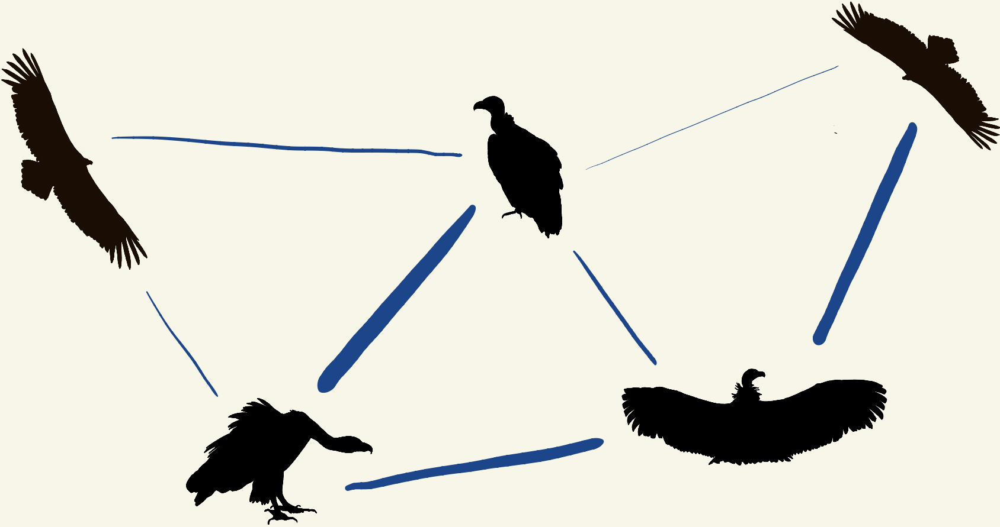

### Hi there 👋

I'm Kaija (rhymes with Maya). I'm a biologist and data scientist. Currently, I'm a first-year PhD student in the Pinter-Wollman lab at UCLA, studying the movement ecology and social behavior of vultures. 

I have a B.S. in E&EB (Ecology & Evolutionary Biology) from Yale, where I studied wood frog tadpoles for my thesis [project](https://github.com/kaijagahm/BurstSpeed). I investigated whether a tradeoff between development rate (e.g. how fast the tadpole gets bigger and grows legs) and performance (e.g. how fast the tadpole startle-swims ~~when it gets attacked by a predator~~ when you poke its tail with a stick) could help explain countergradient variation in development rate. If you want to learn more, [I gave a talk](https://drive.google.com/file/d/1CxEaJEx65V1qLG2tahUCO8qabylamchG/view?usp=sharing). The results are published [here](https://onlinelibrary.wiley.com/doi/abs/10.1002/jez.2434). Email me at kaija.gahm@aya.yale.edu to get access to a PDF if you hit a paywall on that link!

I work mostly in R, although I've dabbled in MATLAB, and I'd like to learn Python soon. 

- :fish:  I recently finished working as a database manager for a collaborative project between the [Cary Institute of Ecosystem Studies](https://www.caryinstitute.org/) and the [Jones Lab](https://www3.nd.edu/~sjones20/) at Notre Dame. [I tracked issues for that over here](https://github.com/MFEh2o/db/issues). I also built a [Shiny app](https://gahmkcaryinstitute.shinyapps.io/lakeLatLongFinder/) to help researchers locate their study lakes.

- 💬  I also worked with the Yale Grammatical Diversity Project ([YGDP](https://ygdp.yale.edu/)) to [manage their research data](https://github.com/kaijagahm?tab=projects). Check out the [interactive Shiny dashboard](https://kaijagahm.shinyapps.io/ygdpDashboard/) that I built over the past several months ([code here](https://github.com/kaijagahm/ygdpDashboard)). I also built a [relational database](https://github.com/kaijagahm/ygdpDB) for the YGDP.

- :bird:  My blog, which covers mostly R-related topics, has recently migrated from its old location at [woodpeckR](https://thewoodpeckr.wordpress.com/) to [a page on my personal site](https://kaijagahm.netlify.app/blog.html). The old woodpeckR site is still valid, though!

- :handshake: I volunteer as a mentor in the R For Data Science community [Slack workspace](r4ds.io/join), where I hold weekly "office hours". I also answer questions over at [RStudio Community](https://community.rstudio.com/u/kaijabean/activity/replies). 

- ❓  Ask me about birds, frogs, and the [tidyverse](https://www.tidyverse.org/) :milky_way:

- 📫  How to reach me: I love getting emails at (kaija.gahm@aya.yale.edu). Twitter DMs are also great (@kaija_bean). 

- 😄  Pronouns: She/her
